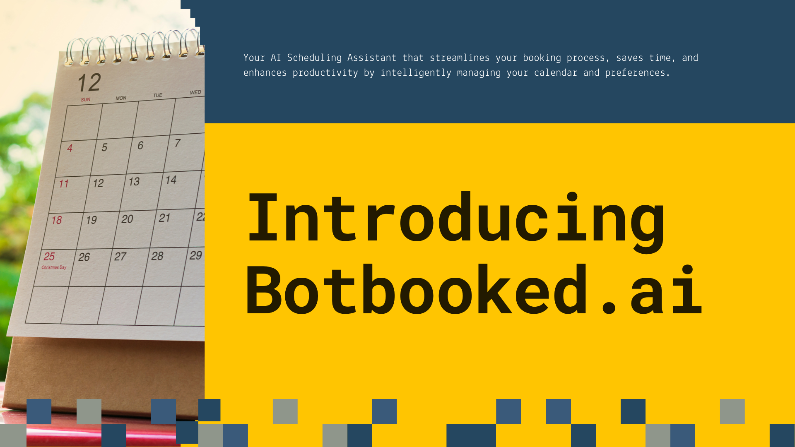

# Botbooked.ai - Meeting Scheduling Assistant

This project is an **Agentic AI-powered** scheduling assistant designed to manage calendar events, process user requests, and integrates with large language models (LLMs) for intelligent decision-making. The project includes a Flask-based API, integration with vLLM for LLM inference.



## Project Structure

### Core application logic

```
├── app.py                          # Main application entry point 
├── assets/                         # Static assets 
│   ├── amd.png                     # GPU Logo
    |── botbooked_ai.png            # Project Logo
│   └── Usecase_presentation.mov    # Use case presentation
├── run.py                          # Flask server for API integration 
├── streamlit_app.py                # Streamlit app for UI 
├── Submission.ipynb                # Submission notebook (Template)
└── README.md                       # Project documentation
```

### Step - 1: Install dependencies

``` pip install -r requirements.txt```

### Step - 2: Running the Flask Server

```streamlit run streamlit_app.py```

### Step - 3: Input details 

Provide the input JSON in the below template to the Streamlit application, and click on Submit button. 

The inference will happen on AMD MI300 GPU hosted on vLLM and sends back the final response to the user.

## Hardware and Software Stack

- LangGraph (Agentic-AI framework)
- Qwen-3 4B LLM Model
- AMD Instinct MI300 GPU 
- vLLM for Model serving

## Key Endpoints

#### ```/receive ``` (POST Method)

-  **Description:** Processes user requests and returns AI-generated responses.
- **Request Body:** JSON object containing user data.
- **Response:** JSON object with processed output.

#### Basic Troubleshooting

- ```FileNotFoundError```: Ensure the required token files are present in the keys/ directory.
- ```Port in Use:``` If the Flask server fails to start, ensure port 5000 is not in use or modify the port in run.py.

## Presentation Preview 

Access a 1-min <a href="assets/Usecase_presentation.mov">video presentation</a> detailing about the project!

## License
This project is licensed under the MIT License. See the LICENSE file for details.

## Acknowledgments

Inference generated through vLLM and model serving from AMD Instinct MI-300 GPU.


vLLM for efficient LLM inference and Hugging Face for providing access to LLMs.

